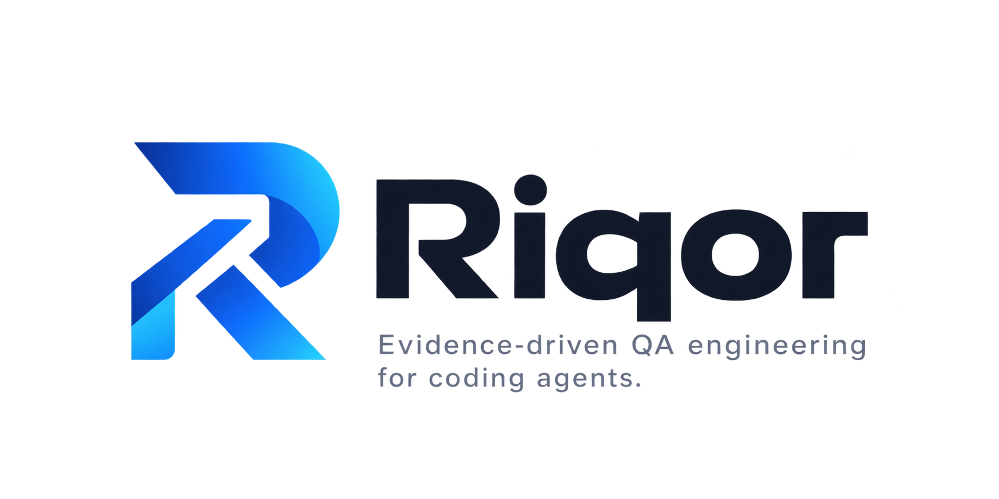

<p align="center">
  
</p>

# Riqor (Agent-next)

<p align="center">
  <strong>English</strong> | <a href="README.zh-CN.md">简体中文</a>
</p>

Riqor is an AI-assisted workspace for planning, producing, and validating
software testing work. Start with whatever you already have—a PRD, requirement,
code change, bug report, release baseline, or existing test cases—and tell Riqor
what you want to achieve. It identifies what can be reused, highlights what is
missing, and guides the work toward reviewable test deliverables.

You do not need to understand its internal workflows or begin from a fixed
stage. Riqor connects requirements, risks, test points, test cases, automation,
execution evidence, and reports so that results remain traceable as the project
changes.

Typical uses include:

- designing tests for a new feature;
- planning regression coverage for a bug or code change;
- organizing release acceptance and its supporting evidence;
- preparing API automation from reviewed test cases.

Riqor is designed to run in agent environments such as Codex and Hermes Agent.
The agent handles conversation and analysis, while the underlying `agent-next`
CLI records workflow state, checks dependencies, and enforces quality gates.
Remote writes and shared-environment changes still require explicit approval.

### Design and documentation

Agent-next is the project-agnostic workflow engine behind Riqor. Its v0.1
design is documented in
[`docs/agent-next-generalization-v0.1.md`](docs/agent-next-generalization-v0.1.md),
and the [`Shop Platform quickstart`](docs/quickstart-shop-platform.md) provides
a verified end-to-end example. The implementation reuses the same Workflow,
Skill, Run State, Stage Gate, template, and validator chain throughout the
project rather than maintaining a parallel execution model.

## Architecture summary

The Core includes the path resolver, phase router, Run State
writer/schema/migrator, template copier, artifact validators, test-case
validator, Stage Gate, and these project-agnostic capabilities:

- Project Profiles
- Artifact metadata
- Declarative Capabilities
- Declarative Workflow manifests and Stage Gate rules
- Schema-validated automation providers
- Knowledge bootstrap layout
- Artifact inventory and stale propagation
- Scope-aware dependency planning

The repository provides generic `requirement-analysis`, `test-analysis`, `test-case-design`,
`automation`, `test-execution`, `reporting`, `release-acceptance`, and
`zentao-sync` Skills.
Capabilities now reference their authoritative Workflow, Phase, and Skill.
Each `workflows/<id>/workflow.yaml` owns its phase order, documents, output
scope directory, and phase-specific Gate rules. Automation Skills expose a
schema-validated `provider.yaml`; Doctor and preparation share one loader.
Product-specific automation and data rules belong in downstream Project
Profiles or private extension packages, not this repository.
`inventory`, `run`, `status`, `explain`, `scaffold`, and `gate` use the same
execution chain. Artifact identity, revisions, and traceability
live under `runs/`; `outputs/` contains only user-facing deliverables. No
parallel Adapter SDK or second execution-state model is developed.

## Migrated execution infrastructure

The compatibility commands remain directly runnable behind the unified CLI:

```bash
python3 tools/run_state.py --help
python3 tools/copy_template.py --help
python3 tools/validate_run_state.py --help
python3 tools/stage_gate.py --help
```

For new run state, use Project Profile identity instead of the legacy product
line:

```bash
python3 tools/run_state.py \
  --run-id demo \
  --project-id shop-platform \
  --track storefront \
  --entry feature-quality \
  --phase Intake
```

## Setup

```bash
python3 -m venv .venv
source .venv/bin/activate
pip install -e .
cp .env.example .env
```

Fill only the local values you need. The CLI reads the root `.env` without
overwriting variables supplied by the current shell or CI. Check names and
presence without exposing values with `agent-next env --group ZENTAO`; see
[`docs/environment.md`](docs/environment.md).

## Use with Codex or Hermes

Agent-next combines agent-facing Skills with a deterministic local CLI. After
completing the setup above, expose the repository's bundled Skills through the
cross-agent project directory:

```bash
mkdir -p .agents
ln -s ../skills .agents/skills
```

Run these commands from the repository root. The symlink keeps the Skills in
their source location, so updates in `skills/` are immediately available to
the agent. If `.agents/skills` already exists, reuse or replace it deliberately
instead of running the link command again.

### Codex

Start Codex in the repository, use `/skills` to confirm that `agent-next` is
available, then invoke it explicitly with `$agent-next` or describe a matching
testing-engineering task and let Codex select it:

```text
$agent-next inspect the available inputs and plan the test_cases goal for checkout
```

Codex also reads the repository's `AGENTS.md`, which defines the project
contracts and required verification commands.

### Hermes Agent

Hermes discovers project-local Skills under `.agents/skills`. Trust the cloned
repository once, then start a new session and invoke the router Skill as a slash
command:

```bash
hermes skills trust
hermes chat -q "/agent-next inspect the available inputs and plan the test_cases goal for checkout"
```

The router loads only the downstream Skills required by the selected workflow.
Both hosts can then use the `agent-next` CLI for inventory, planning, Run State,
artifact creation, and Stage Gates. Remote writes and shared-environment or
shared-data changes remain explicit confirmation boundaries.

For host-specific behavior, see the official [Codex Skills documentation](https://developers.openai.com/codex/skills)
and [Hermes Agent Skills documentation](https://github.com/NousResearch/hermes-agent/blob/main/website/docs/user-guide/features/skills.md).

## Validate the example project

```bash
agent-next doctor --project examples/shop-platform/project.yaml
```

Expected result:

```text
OK project shop-platform
OK knowledge index examples/shop-platform/knowledge/_index.md
OK capabilities 18
OK artifact templates 16
```

## Initialize a new project

Create an empty project with the standard knowledge structure:

```bash
agent-next init \
  --project-id my-product \
  --name "My Product" \
  --track web \
  --track backend \
  --default-track backend
```

Register existing background documents during initialization:

```bash
agent-next init \
  --project-id my-product \
  --name "My Product" \
  --source docs/product-prd.md
```

Sources must already exist under the repository root. They are registered in
`knowledge/<project-id>/_sources.yaml` but are not treated as confirmed
knowledge. `init` refuses to overwrite an existing Project Profile or knowledge
root.

For a project that will generate API automation, declare the integration at
initialization time:

```bash
agent-next init \
  --project-id iot-ops \
  --name "IoT Ops" \
  --automation api
```

This writes an API-capable repository entry and an immutable
`rigorpath-api-test` runtime revision into the Project Profile. It does not
download anything during initialization. After an automation classification is
reviewed, prepare the thin consumer project with:

```bash
agent-next prepare-automation \
  --project config/projects/iot-ops.yaml \
  --classification-artifact AUTO-CLASS-001 \
  --test-cases-artifact TC-SUITE-001 \
  --implementation-artifact AUTO-IMPL-001 \
  --run-id automation-login
```

Both input artifacts must already be registered and ready. Only `A0` or `A1`
rows whose target is `api` or `hybrid` trigger preparation, and every eligible
row must name the selected repository as its destination.
The selected Skill provider creates `repositories/automation/iot-ops-api-test`
and resolves its pinned dependency. The command then creates a draft
`automation_implementation` artifact in the same Run State. Use `--no-install`
for an offline scaffold.

Project knowledge is optional for users. `init` creates an empty internal
context skeleton so a new project can start from only a description or PRD.
When requirement work finds stable reusable knowledge, record a proposal file
based on `templates/knowledge/knowledge-proposal.yaml.tmpl`:

```bash
agent-next record \
  --run-id checkout-requirement \
  --knowledge-proposal runs/checkout-requirement/order-timeout.yaml

agent-next knowledge \
  --project examples/shop-platform/project.yaml \
  --run-id checkout-requirement \
  --source-artifact REQ-checkout-001
```

The second command previews names and target paths only. If the user explicitly
chooses “confirm requirement and persist knowledge”, apply those listed
proposals with `--confirm`; confirming the requirement alone leaves them
proposed. Existing knowledge pages are never overwritten by this shortcut.

The same `record` command records structured Stage Gate evidence without using
the compatibility Run State script directly:

```bash
agent-next record \
  --run-id checkout-risk \
  --repository kind=dev,name=shop,path=repositories/product/shop,commit=<sha> \
  --repository-evidence repo=shop,evidence_type=commit,reference=<sha>,supports=RISK-001 \
  --required-env api \
  --checked-env api \
  --target staging \
  --confirmation id=CONF-001,action=shared_environment_execution,status=confirmed \
  --trace from=REQ-001,to=RISK-001,relation=analyzed_by
```

## Inspect artifacts and plan a goal

Artifact metadata lives under `runs/<run-id>/artifacts/*.json`; `outputs/`
contains only user-facing Markdown deliverables. Each artifact belongs to a
`scope_id`, such as a feature, bug, or release scope.

```text
outputs/<project-id>/features/<requirement-name>/requirement-spec.md
outputs/<project-id>/features/<requirement-name>/risk-analysis.md
outputs/<project-id>/features/<requirement-name>/test-points.md
outputs/<project-id>/features/<requirement-name>/test-cases.md
outputs/<project-id>/bugs/<bug-id-or-name>/regression-report.md
outputs/<project-id>/releases/<version>/acceptance-report.md
```

Artifact IDs and revisions are deliberately absent from user-facing filenames.

```bash
agent-next inventory \
  --project examples/shop-platform/project.yaml \
  --scope checkout

agent-next plan \
  --project examples/shop-platform/project.yaml \
  --workflow feature-quality \
  --scope checkout \
  --goal test_cases
```

The example starts with only a ready PRD. The plan therefore explains the Intake
gate plus four artifact-producing steps needed to reach `test_cases`. When more
than one Workflow Pack is installed, select one with `--workflow <pack-id>`;
Agent-next will not guess between packs. `plan` remains read-only.

## Prepare a run, create an artifact, and validate the phase

Start with the planned Intake gate. This records the authoritative Workflow,
Phase, required Skills, and hash receipts; it does not perform a remote action:

```bash
agent-next run \
  --project examples/shop-platform/project.yaml \
  --workflow feature-quality \
  --capability feature-intake \
  --run-id checkout-requirement \
  --track backend

agent-next record \
  --run-id checkout-requirement \
  --knowledge-plan-status not_needed \
  --knowledge-plan-summary "The current project knowledge is sufficient" \
  --knowledge-used path=skills/requirement-analysis/references/intake-sources.md,purpose=intake \
  --note intake_input:PRD-checkout-001

agent-next gate \
  --project examples/shop-platform/project.yaml \
  --run-id checkout-requirement
```

After Intake passes, move the same Run State to the first artifact-producing
step and scaffold its declared template:

```bash
agent-next run \
  --project examples/shop-platform/project.yaml \
  --workflow feature-quality \
  --capability requirement-specification \
  --run-id checkout-requirement \
  --track backend

agent-next scaffold \
  --project examples/shop-platform/project.yaml \
  --workflow feature-quality \
  --capability requirement-specification \
  --scope checkout \
  --artifact-id REQ-checkout-001 \
  --run-id checkout-requirement \
  --source-artifact PRD-checkout-001@1 \
  --track backend
```

Fill the generated Markdown, update the Run State evidence required by the
Workflow phase, then validate it:

```bash
agent-next gate \
  --project examples/shop-platform/project.yaml \
  --artifact-id REQ-checkout-001 \
  --run-id checkout-requirement \
  --mark-ready
```

`scaffold` delegates to the inherited managed template copier and registers the
artifact in the same Run State. `gate` delegates to the artifact-type validator
and strict Stage Gate. It refuses ready when the template is untouched or still
contains placeholders, upstream
revisions changed, sources are not ready, the predecessor phase has not passed,
or required knowledge/repository/confirmation evidence is missing. A successful
ready transition records the deliverable SHA-256; Inventory marks it stale if
the content later changes.

Inspect the live state and the reason for every blocker:

```bash
agent-next status --run-id checkout-requirement
agent-next explain --run-id checkout-requirement
```

## Run tests

```bash
python -m unittest discover -s tests -p 'test_*.py'
```

## Repository map

```text
config/               Project Profile registrations
knowledge/            Reusable knowledge, isolated by project
workflows/            Declarative workflow capabilities
skills/               Agent-facing workflow instructions
templates/            Managed .md.tmpl sources for knowledge and artifacts
schemas/              Public JSON Schema contracts
tools/                Core engine, validators, state tools, and CLI
repositories/         Local product, automation, and tool repository mirrors
outputs/              Generated deliverables, isolated by project
runs/                 Durable execution state
examples/             Runnable example projects
docs/                 Product and architecture documentation
tests/                Unit and contract tests
```

The repository is the runtime boundary. Core code intentionally lives in
`tools/`; there is no separate `src/agent_next/` package tree. An editable
install only provides the `agent-next` command for this checkout.
